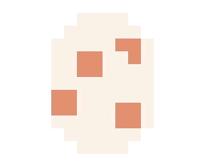
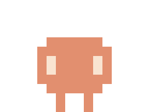
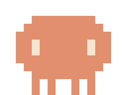
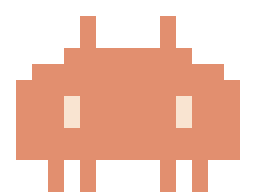
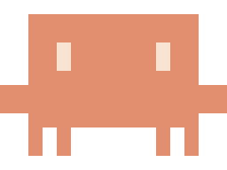
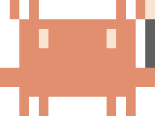

# Claude Usage Bot

[](https://github.com/munolee/claude-usage-bot/releases/latest)
[](https://github.com/munolee/claude-usage-bot/releases/latest/download/ClaudeUsageBot.dmg)

A small macOS overlay app that lives on the bottom-right of your screen and shows
how much of your **Claude Code 5-hour session** you've used — as a tiny pixel
mascot that **evolves through six forms** as your usage climbs.

<p align="center">
  
</p>

> Uses Claude Code's OAuth token (read from your macOS keychain) to pull exact
> usage from Anthropic's private `/api/oauth/usage` endpoint. Falls back to a
> local JSONL cost estimate if the token isn't available. No separate API key
> required.

---

## What it does

Claude Code writes a JSONL transcript of every session under
`~/.claude/projects/`. This app:

1. Tails those transcripts to count assistant-side token usage.
2. Groups records into the **5-hour rolling sessions** Anthropic uses for plan limits.
3. Estimates the active session's cost via per-model pricing.
4. Compares that cost to a configurable **session budget (USD)** to derive a `%`.
5. Renders the mascot at the matching evolution stage, with a black speech
   bubble showing `<percent> · <time-until-reset>`.

You can drag the mascot anywhere on screen (position persists across launches).
Right-click — or click the menu-bar icon — to configure everything.

---

## Evolution stages

The 5h session's `cost / budget` ratio drives which form the mascot takes:

| Stage | 한국어 | Threshold | Sprite |
|---|---|---|---|
| Egg | 알 | 0% (no session) |  |
| Baby | 유년기 | 0% – 20% |  |
| Growth | 성장기 | 20% – 50% |  |
| Mature | 성숙기 | 50% – 80% |  |
| Perfect | 완전체 | 80% – 100% |  |
| Ultimate | 궁극체 | ≥ 100% |  |

Every sprite shares a 16 × 12 cell canvas (5pt per cell ⇒ 80 × 60pt frame). The
egg is the only stage with an inverted palette — cream-white shell with
salmon-orange speckles — to signal "not hatched yet." Each later form adds
features over the previous one's silhouette so the lineage stays obvious:

- **Egg** → speckled oval, no face.
- **Baby** → small chubby body with 1×2 eye-slits and two stub legs.
- **Growth** → cute vertical oval, four short legs.
- **Mature** → wider 14-cell chubby body with two horns sprouting from the head top.
- **Perfect** → squared-off space-invader silhouette with a full 16-wide arm band.
- **Ultimate** → Perfect's silhouette + four spikes on top + a magic wand on the
  right (cream crystal, dark-grey shaft), all gripped by the right hand.

Want to flip through every form in one window? Right-click the mascot →
**전체 모습 보기**. The mascot's eyes blink at random intervals (1×2 cell
slits closing briefly); the egg's speckles and Ultimate's wand crystal stay lit
through the blink — the rest darken to body color for that frame.

---

## Speech bubble

Always visible next to the mascot, in a black rounded rectangle with a tail.
Format:

```
45%  ·  2h 13m
```

- The `%` is `current_session_cost_estimate / configured_budget`. **Not capped at
  100%** — if it exceeds your budget, you'll see e.g. `230% · 1h 12m` so you
  know you've blown past the threshold (without losing visibility).
- The `h / m` countdown is the wall-clock time until the 5-hour session window
  resets. You can manually anchor this via the calibration dialog (see below).

The bubble updates in place every 30 seconds when the poller refreshes. The
mascot's left-click also forces a refresh. The tail auto-flips left/right
depending on which half of the screen you've dragged the mascot to, so the
bubble always stays on-screen.

---

## Context menu (right-click the mascot)

| Item | What it does |
|---|---|
| Header (e.g. `성숙기 · 45% · 2h 13m`) | Read-only current state |
| **새로고침** (`⌘R`) | Re-scan transcripts immediately |
| **숨기기** / **보이기** (`⌘P`) | Hide / show the mascot |
| **위치 초기화** | Drop the saved drag position; mascot snaps back to bottom-right |
| **전체 모습 보기** | Open a window showing every stage side by side |
| **Claude Code 값에 맞춰 보정…** | Calibrate percent **and** remaining time (see below) |
| **세션 한도: $…** ▸ | Pick a coarse budget: $20 / $50 / $100 / $200 / $500 / $1000 |
| **Quit** (`⌘Q`) | Stop the app |

The same menu is also attached to the menu-bar icon for users whose menu bar
isn't crowded enough to hide a status item.

---

## Calibrating to Claude Code

Our `%` is a cost-based estimate, while Claude Code's `/usage` reports against
Anthropic's actual plan-tier metering (which factors message count, model
weighting, cache usage, etc.). These two numbers don't have to match — and our
configured budget defaults to a guess (`$100`).

The calibration dialog has two **optional** fields:

| Field | Effect |
|---|---|
| 사용률 (예: `30`) | Back-solves `budgetUSD = current_session_cost / (pct/100)` so our `%` matches what Claude Code shows. |
| 남은 시간 (예: `2h 30m`, `2:30`, `45m`, `150`) | Pins the session-reset countdown to `now + parsed`. Useful when our auto-detected session anchor disagrees with Claude Code's. Auto-clears when the time passes. |

Both values persist in `UserDefaults`. Leave a field blank to skip that side of
the calibration. After the first calibration the two numbers should track each
other closely until the next session boundary.

---

## Install

Pick whichever path suits you — both end up with the same
`/Applications/ClaudeUsageBot.app`.

### GUI: download the latest `.dmg`

👉 **[Download ClaudeUsageBot.dmg (latest release)](https://github.com/munolee/claude-usage-bot/releases/latest/download/ClaudeUsageBot.dmg)**

1. Open the downloaded `.dmg` (double-click).
2. Drag `ClaudeUsageBot.app` into `/Applications`.
3. Launch from Spotlight / Launchpad — the build is signed with a Developer
   ID certificate and notarized by Apple, so Gatekeeper lets it run without
   the "unidentified developer" warning or the `xattr` workaround.

You can also browse all releases on the
[Releases page](https://github.com/munolee/claude-usage-bot/releases).

### Terminal: one-liner (no repo clone, no Swift toolchain)

```sh
curl -fsSL https://raw.githubusercontent.com/munolee/claude-usage-bot/main/scripts/install-from-release.sh | bash
```

The script downloads the latest `.dmg`, mounts it, copies the app into
`/Applications`, ejects the image, and launches the app. Pin a version with
`VERSION=v0.2.0 bash …` if needed.

To auto-start at login: **System Settings → General → Login Items → +
`/Applications/ClaudeUsageBot.app`**.

### First-run permission prompt

The app reads Claude Code's OAuth token from your macOS keychain to fetch
usage from Anthropic directly. After launch, right-click the mascot →
**"Claude Code 로그인…"**, then choose **"Always Allow"** in the macOS
keychain dialog. If you dismiss it by accident, open
**Keychain Access → login → Claude Code-credentials → Access Control**
and add ClaudeUsageBot (or pick "Allow all applications").

### Keychain dialog keeps reappearing? Make it stop for good

`Always Allow` is bound to a specific keychain *item*. Claude Code's
daemon rotates the `Claude Code-credentials` item every few hours, and
each rotation wipes the ACL you set — so the dialog comes back every
~8 hours even after you click `Always Allow`. The app caches the token
to make this rare, but only one setting kills it completely:

1. Open **Keychain Access** → left sidebar **`login`**
2. Search `Claude Code-credentials` → double-click the entry
3. Switch to the **`Access Control`** tab
4. Pick the radio **`Allow all applications to access this item`**
5. **Save Changes** → enter your account password once

After this the dialog never appears again, regardless of how often
Claude Code rotates the token. Security note: this only loosens access
*within* your already-locked login keychain — anyone who could already
prompt the dialog had to be signed into your user account anyway.

### Build from source

```sh
./scripts/install.sh         # build + install to /Applications
swift run claudeusagebot     # run without installing
./scripts/package-app.sh     # build the .app bundle without copying
```

---

## Project structure

```
Sources/
  ClaudeUsageCore/         Pure logic — no AppKit, fully testable
    UsageRecord.swift      One assistant message's token usage
    UsageReader.swift      JSONL transcript parser
    UsageAggregator.swift  Today / 7-day / all-time rollups, dedup by messageId
    Pricing.swift          Per-model $/MTok lookup (Opus / Sonnet / Haiku)
    SessionWindow.swift    5h rolling-window detector + usageFraction math
    EvolutionStage.swift   fraction → stage thresholds
    UsageFormatter.swift   "1.2M tokens", "$0.42" helpers
    MascotSprite.swift     Pixel-art sprite strings — single source of truth

  claudeusagebot/          AppKit executable
    AppMain.swift          AppDelegate, status menu, calibration dialog
    OverlayController.swift Borderless NSPanel anchored to dragged position
    MascotView.swift       Pixel-art drawing (consumes MascotSprite)
    SpeechBubbleView.swift Rounded bubble with auto-flipping tail
    StagePreview.swift     "전체 모습 보기" window
    UsagePoller.swift      30-second background refresh

  spriterender/            Standalone PNG exporter (used to generate this README's
                           assets — `swift run spriterender`)

Tests/
  ClaudeUsageCoreTests/    Parser, aggregator, pricing, session math, stage thresholds

docs/
  stages/                  Rendered PNGs of every evolution stage + the combined banner
```

The pixel-art data (`MascotSprite`) lives in Core so the live app and the PNG
renderer can't drift. The renderer brings only the color palette (a few
`NSColor` constants) — everything else is shared.

---

## Tests

```sh
swift test
```

Covers JSONL parsing, message-ID dedupe, today/week boundary math, pricing for
known models, the 5-hour rolling-window detector, and stage-threshold edges.

---

## Pricing & accuracy notes

`Pricing.swift` carries best-effort per-million-token rates for the Claude
families (Opus / Sonnet / Haiku). Update them when Anthropic publishes new
tiers. Unknown models contribute zero cost but still count toward token totals.

Because Anthropic's plan-tier limits are not strictly proportional to dollar
cost — message count, model class, and cache weighting all factor in — our
`%` can drift from `/usage`. The calibration dialog is the easiest fix; if you
notice a meaningful gap, re-calibrate.

---

## Acknowledgments

Evolution staging owes more than a little to Digimon's hatch → in-training →
rookie → champion → ultimate → mega chain.
